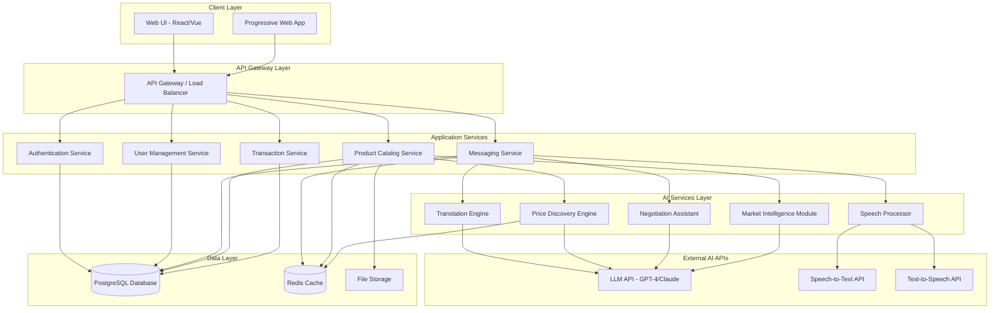

# Design Document: The Multilingual Mandi

## Overview

The Multilingual Mandi is a web-based platform that leverages frontier AI technologies to break language barriers in local Indian markets. The system architecture follows a modular, service-oriented design with clear separation between the frontend user interface, backend API services, AI integration layer, and data persistence layer.

The platform is built around three core AI-powered engines:
1. **Translation Engine**: Provides real-time multilingual translation for text and speech
2. **Price Discovery Engine**: Analyzes market data to provide fair price recommendations
3. **Negotiation Assistant**: Facilitates culturally-aware negotiation between parties

The design prioritizes simplicity, accessibility, and offline capability while maintaining production-grade security and scalability. The system is deployable from GitHub with minimal configuration and includes comprehensive documentation for the hackathon submission.

## Architecture

### High-Level Architecture



### Technology Stack

**Frontend:**
- React or Vue.js for UI components
- Progressive Web App (PWA) for offline capability
- TailwindCSS for responsive, accessible styling
- IndexedDB for offline data storage
- Service Workers for background sync

**Backend:**
- Node.js with Express or Python with FastAPI
- RESTful API design with WebSocket support for real-time messaging
- JWT-based authentication
- Rate limiting and request validation

**AI Integration:**
- OpenAI GPT-4 or Anthropic Claude for translation and negotiation
- OpenAI Whisper or Google Speech-to-Text for voice input
- Google Text-to-Speech or ElevenLabs for voice output
- Custom ML models for price prediction (scikit-learn or TensorFlow)

**Data Layer:**
- PostgreSQL for relational data (users, products, transactions)
- Redis for caching and session management
- S3-compatible storage for product images and voice recordings

**Deployment:**
- Docker containers for all services
- Docker Compose for local development and simple deployment
- Environment-based configuration
- GitHub Actions for CI/CD (optional)

## Components and Interfaces

### 1. Authentication Service

**Responsibilities:**
- User registration and login
- Session management
- Password hashing and validation
- JWT token generation and verification

**Key Interfaces:**

```typescript
interface AuthService {
  register(userData: UserRegistrationData): Promise<UserProfile>;
  login(credentials: LoginCredentials): Promise<AuthToken>;
  logout(token: string): Promise<void>;
  validateToken(token: string): Promise<TokenValidation>;
  refreshToken(token: string): Promise<AuthToken>;
}

interface UserRegistrationData {
  username: string;
  password: string;
  userType: 'vendor' | 'buyer';
  preferredLanguage: SupportedLanguage;
  location?: string;
  phoneNumber?: string;
}

interface LoginCredentials {
  username: string;
  password: string;
}

interface AuthToken {
  accessToken: string;
  refreshToken: string;
  expiresIn: number;
}

interface TokenValidation {
  valid: boolean;
  userId?: string;
  expiresAt?: Date;
}
```

### 2. User Management Service

**Responsibilities:**
- User profile CRUD operations
- Language preference management
- User settings and preferences

**Key Interfaces:**

```typescript
interface UserManagementService {
  getProfile(userId: string): Promise<UserProfile>;
  updateProfile(userId: string, updates: ProfileUpdates): Promise<UserProfile>;
  updateLanguagePreference(userId: string, language: SupportedLanguage): Promise<void>;
  deleteAccount(userId: string): Promise<void>;
}

interface UserProfile {
  id: string;
  username: string;
  userType: 'vendor' | 'buyer';
  preferredLanguage: SupportedLanguage;
  location?: string;
  phoneNumber?: string;
  createdAt: Date;
  lastActive: Date;
}

type SupportedLanguage = 'hi' | 'en' | 'ta' | 'te' | 'bn' | 'mr' | 'gu' | 'kn' | 'ml' | 'pa';

interface ProfileUpdates {
  location?: string;
  phoneNumber?: string;
  preferredLanguage?: SupportedLanguage;
}
```

### 3. Messaging Service

**Responsibilities:**
- Message creation and delivery
- Conversation management
- Real-time message routing via WebSocket
- Message queue for offline users

**Key Interfaces:**

```typescript
interface MessagingService {
  sendMessage(message: MessageInput): Promise<Message>;
  getConversation(conversationId: string, userId: string): Promise<Conversation>;
  listConversations(userId: string): Promise<Conversation[]>;
  markAsRead(conversationId: string, userId: string): Promise<void>;
}

interface MessageInput {
  conversationId?: string;
  senderId: string;
  recipientId: string;
  content: string;
  contentType: 'text' | 'voice';
  originalLanguage: SupportedLanguage;
  voiceDataUrl?: string;
}

interface Message {
  id: string;
  conversationId: string;
  senderId: string;
  recipientId: string;
  originalContent: string;
  originalLanguage: SupportedLanguage;
  translatedContent?: Map<SupportedLanguage, string>;
  contentType: 'text' | 'voice';
  voiceDataUrl?: string;
  timestamp: Date;
  deliveryStatus: 'sent' | 'delivered' | 'read' | 'failed';
}

interface Conversation {
  id: string;
  participants: string[];
  messages: Message[];
  productContext?: string;
  negotiationState?: NegotiationState;
  createdAt: Date;
  lastMessageAt: Date;
}
```

### 4. Translation Engine

**Responsibilities:**
- Text translation between supported languages
- Translation caching for efficiency
- Fallback handling for translation failures

**Key Interfaces:**

```typescript
interface TranslationEngine {
  translate(text: string, from: SupportedLanguage, to: SupportedLanguage): Promise<TranslationResult>;
  translateBatch(texts: string[], from: SupportedLanguage, to: SupportedLanguage): Promise<TranslationResult[]>;
  detectLanguage(text: string): Promise<SupportedLanguage>;
}

interface TranslationResult {
  originalText: string;
  translatedText: string;
  sourceLanguage: SupportedLanguage;
  targetLanguage: SupportedLanguage;
  confidence: number;
  cached: boolean;
}
```

**Implementation Details:**
- Use LLM API (GPT-4 or Claude) with system prompts optimized for Indian language translation
- Implement Redis caching with key format: `translation:{hash(text)}:{from}:{to}`
- Cache TTL: 7 days for common phrases, 1 day for unique content
- Fallback: Return original text with confidence 0 if translation fails

### 5. Speech Processor

**Responsibilities:**
- Speech-to-text conversion
- Text-to-speech generation
- Audio format handling and compression

**Key Interfaces:**

```typescript
interface SpeechProcessor {
  speechToText(audioData: Buffer, language: SupportedLanguage): Promise<SpeechToTextResult>;
  textToSpeech(text: string, language: SupportedLanguage): Promise<TextToSpeechResult>;
}

interface SpeechToTextResult {
  text: string;
  language: SupportedLanguage;
  confidence: number;
  duration: number;
}

interface TextToSpeechResult {
  audioData: Buffer;
  audioFormat: 'mp3' | 'wav';
  duration: number;
}
```

**Implementation Details:**
- Use OpenAI Whisper or Google Speech-to-Text for STT
- Use Google TTS or ElevenLabs for TTS
- Support audio formats: MP3, WAV, OGG
- Maximum audio length: 60 seconds per message
- Compress audio to reduce bandwidth (target: <100KB per message)

### 6. Product Catalog Service

**Responsibilities:**
- Product listing management
- Product search with multilingual support
- Category management
- Image upload and storage

**Key Interfaces:**

```typescript
interface ProductCatalogService {
  createProduct(product: ProductInput): Promise<Product>;
  updateProduct(productId: string, updates: ProductUpdates): Promise<Product>;
  deleteProduct(productId: string): Promise<void>;
  searchProducts(query: SearchQuery): Promise<SearchResult>;
  getProduct(productId: string): Promise<Product>;
  listVendorProducts(vendorId: string): Promise<Product[]>;
}

interface ProductInput {
  vendorId: string;
  name: string;
  description: string;
  category: string;
  basePrice: number;
  unit: string;
  quantity: number;
  images: string[];
  language: SupportedLanguage;
}

interface Product {
  id: string;
  vendorId: string;
  name: Map<SupportedLanguage, string>;
  description: Map<SupportedLanguage, string>;
  category: string;
  basePrice: number;
  unit: string;
  quantity: number;
  images: string[];
  createdAt: Date;
  updatedAt: Date;
}

interface SearchQuery {
  keyword?: string;
  category?: string;
  minPrice?: number;
  maxPrice?: number;
  location?: string;
  language: SupportedLanguage;
  page: number;
  pageSize: number;
}

interface SearchResult {
  products: Product[];
  total: number;
  page: number;
  pageSize: number;
}
```

### 7. Price Discovery Engine

**Responsibilities:**
- Market price analysis
- Fair price calculation
- Price recommendation generation
- Historical price tracking

**Key Interfaces:**

```typescript
interface PriceDiscoveryEngine {
  getFairPrice(request: PriceRequest): Promise<PriceRecommendation>;
  getHistoricalPrices(productCategory: string, location: string, days: number): Promise<PriceHistory>;
  recordTransaction(transaction: TransactionRecord): Promise<void>;
}

interface PriceRequest {
  productCategory: string;
  productName: string;
  quantity: number;
  unit: string;
  location: string;
  quality?: 'low' | 'medium' | 'high';
  season?: string;
}

interface PriceRecommendation {
  fairPrice: number;
  priceRange: {
    min: number;
    max: number;
  };
  confidence: number;
  factors: PriceFactor[];
  marketAverage: number;
  trend: 'rising' | 'falling' | 'stable';
  lastUpdated: Date;
}

interface PriceFactor {
  name: string;
  impact: 'positive' | 'negative' | 'neutral';
  description: string;
}

interface PriceHistory {
  category: string;
  location: string;
  dataPoints: PriceDataPoint[];
}

interface PriceDataPoint {
  date: Date;
  averagePrice: number;
  minPrice: number;
  maxPrice: number;
  transactionCount: number;
}
```

**Implementation Details:**
- Use historical transaction data for baseline pricing
- Apply ML model (linear regression or time series) for trend analysis
- Consider factors: seasonality, location, quality, quantity
- Use LLM for contextual analysis when data is sparse
- Update price cache every 6 hours

### 8. Negotiation Assistant

**Responsibilities:**
- Analyze price quotes against fair prices
- Provide negotiation suggestions
- Consider cultural context
- Track negotiation progress

**Key Interfaces:**

```typescript
interface NegotiationAssistant {
  analyzeQuote(quote: PriceQuote, context: NegotiationContext): Promise<NegotiationAdvice>;
  suggestCounteroffer(currentOffer: number, context: NegotiationContext): Promise<CounterofferSuggestion>;
  evaluateAgreement(agreedPrice: number, context: NegotiationContext): Promise<AgreementEvaluation>;
}

interface PriceQuote {
  productId: string;
  offeredPrice: number;
  quantity: number;
  offeredBy: 'vendor' | 'buyer';
  timestamp: Date;
}

interface NegotiationContext {
  fairPrice: number;
  priceRange: { min: number; max: number };
  buyerLanguage: SupportedLanguage;
  vendorLanguage: SupportedLanguage;
  buyerLocation: string;
  vendorLocation: string;
  negotiationHistory: PriceQuote[];
}

interface NegotiationAdvice {
  recommendation: 'accept' | 'reject' | 'counter';
  reasoning: string;
  suggestedResponse: string;
  culturalTips: string[];
}

interface CounterofferSuggestion {
  suggestedPrice: number;
  reasoning: string;
  phraseTemplate: string;
}

interface AgreementEvaluation {
  fairness: 'excellent' | 'good' | 'fair' | 'poor';
  savingsOrLoss: number;
  percentageFromFairPrice: number;
  feedback: string;
}

interface NegotiationState {
  currentOffer: number;
  counterOffers: number;
  status: 'active' | 'agreed' | 'abandoned';
  agreedPrice?: number;
}
```

**Implementation Details:**
- Use LLM with cultural context prompts for each language/region
- Provide suggestions in user's preferred language
- Consider negotiation norms (e.g., expected discount ranges by region)
- Track negotiation rounds to detect stalemates
- Suggest compromise at midpoint after 3+ rounds

### 9. Market Intelligence Module

**Responsibilities:**
- Price trend analysis
- Demand forecasting
- Market insights generation
- Vendor performance analytics

**Key Interfaces:**

```typescript
interface MarketIntelligenceModule {
  getPriceTrends(category: string, location: string, days: number): Promise<TrendAnalysis>;
  getDemandForecast(category: string, location: string, days: number): Promise<DemandForecast>;
  getMarketInsights(vendorId: string): Promise<MarketInsights>;
}

interface TrendAnalysis {
  category: string;
  location: string;
  period: { start: Date; end: Date };
  trend: 'rising' | 'falling' | 'stable';
  percentageChange: number;
  chartData: PriceDataPoint[];
  insights: string[];
}

interface DemandForecast {
  category: string;
  location: string;
  forecastPeriod: { start: Date; end: Date };
  predictions: DemandPrediction[];
  confidence: number;
}

interface DemandPrediction {
  date: Date;
  expectedDemand: 'low' | 'medium' | 'high';
  predictedPriceRange: { min: number; max: number };
}

interface MarketInsights {
  vendorId: string;
  competitivePosition: 'below_market' | 'at_market' | 'above_market';
  recommendations: string[];
  topSellingCategories: string[];
  priceComparison: {
    category: string;
    vendorAverage: number;
    marketAverage: number;
    difference: number;
  }[];
}
```

### 10. Transaction Service

**Responsibilities:**
- Transaction record management
- Transaction history queries
- Export functionality

**Key Interfaces:**

```typescript
interface TransactionService {
  recordTransaction(transaction: TransactionInput): Promise<Transaction>;
  getTransactionHistory(userId: string, filters: TransactionFilters): Promise<Transaction[]>;
  exportTransactions(userId: string, format: 'json' | 'csv'): Promise<string>;
}

interface TransactionInput {
  conversationId: string;
  vendorId: string;
  buyerId: string;
  productId: string;
  quantity: number;
  agreedPrice: number;
  totalAmount: number;
}

interface Transaction {
  id: string;
  conversationId: string;
  vendorId: string;
  buyerId: string;
  productId: string;
  productName: string;
  quantity: number;
  agreedPrice: number;
  totalAmount: number;
  timestamp: Date;
}

interface TransactionFilters {
  startDate?: Date;
  endDate?: Date;
  productCategory?: string;
  minAmount?: number;
  maxAmount?: number;
}

interface TransactionRecord {
  productCategory: string;
  productName: string;
  quantity: number;
  unit: string;
  price: number;
  location: string;
  timestamp: Date;
}
```

## Data Models

### Database Schema

**Users Table:**
```sql
CREATE TABLE users (
  id UUID PRIMARY KEY DEFAULT gen_random_uuid(),
  username VARCHAR(255) UNIQUE NOT NULL,
  password_hash VARCHAR(255) NOT NULL,
  user_type VARCHAR(20) NOT NULL CHECK (user_type IN ('vendor', 'buyer')),
  preferred_language VARCHAR(5) NOT NULL,
  location VARCHAR(255),
  phone_number VARCHAR(20),
  created_at TIMESTAMP DEFAULT CURRENT_TIMESTAMP,
  last_active TIMESTAMP DEFAULT CURRENT_TIMESTAMP,
  INDEX idx_username (username),
  INDEX idx_user_type (user_type)
);
```

**Products Table:**
```sql
CREATE TABLE products (
  id UUID PRIMARY KEY DEFAULT gen_random_uuid(),
  vendor_id UUID NOT NULL REFERENCES users(id) ON DELETE CASCADE,
  category VARCHAR(100) NOT NULL,
  base_price DECIMAL(10, 2) NOT NULL,
  unit VARCHAR(50) NOT NULL,
  quantity DECIMAL(10, 2) NOT NULL,
  created_at TIMESTAMP DEFAULT CURRENT_TIMESTAMP,
  updated_at TIMESTAMP DEFAULT CURRENT_TIMESTAMP,
  INDEX idx_vendor_id (vendor_id),
  INDEX idx_category (category)
);
```

**Product Translations Table:**
```sql
CREATE TABLE product_translations (
  id UUID PRIMARY KEY DEFAULT gen_random_uuid(),
  product_id UUID NOT NULL REFERENCES products(id) ON DELETE CASCADE,
  language VARCHAR(5) NOT NULL,
  name VARCHAR(255) NOT NULL,
  description TEXT,
  INDEX idx_product_language (product_id, language)
);
```

**Product Images Table:**
```sql
CREATE TABLE product_images (
  id UUID PRIMARY KEY DEFAULT gen_random_uuid(),
  product_id UUID NOT NULL REFERENCES products(id) ON DELETE CASCADE,
  image_url VARCHAR(500) NOT NULL,
  display_order INT DEFAULT 0,
  INDEX idx_product_id (product_id)
);
```

**Conversations Table:**
```sql
CREATE TABLE conversations (
  id UUID PRIMARY KEY DEFAULT gen_random_uuid(),
  participant1_id UUID NOT NULL REFERENCES users(id),
  participant2_id UUID NOT NULL REFERENCES users(id),
  product_context UUID REFERENCES products(id),
  created_at TIMESTAMP DEFAULT CURRENT_TIMESTAMP,
  last_message_at TIMESTAMP DEFAULT CURRENT_TIMESTAMP,
  INDEX idx_participants (participant1_id, participant2_id)
);
```

**Messages Table:**
```sql
CREATE TABLE messages (
  id UUID PRIMARY KEY DEFAULT gen_random_uuid(),
  conversation_id UUID NOT NULL REFERENCES conversations(id) ON DELETE CASCADE,
  sender_id UUID NOT NULL REFERENCES users(id),
  recipient_id UUID NOT NULL REFERENCES users(id),
  original_content TEXT NOT NULL,
  original_language VARCHAR(5) NOT NULL,
  content_type VARCHAR(20) NOT NULL CHECK (content_type IN ('text', 'voice')),
  voice_data_url VARCHAR(500),
  timestamp TIMESTAMP DEFAULT CURRENT_TIMESTAMP,
  delivery_status VARCHAR(20) DEFAULT 'sent',
  INDEX idx_conversation (conversation_id, timestamp),
  INDEX idx_sender (sender_id),
  INDEX idx_recipient (recipient_id)
);
```

**Message Translations Table:**
```sql
CREATE TABLE message_translations (
  id UUID PRIMARY KEY DEFAULT gen_random_uuid(),
  message_id UUID NOT NULL REFERENCES messages(id) ON DELETE CASCADE,
  language VARCHAR(5) NOT NULL,
  translated_content TEXT NOT NULL,
  INDEX idx_message_language (message_id, language)
);
```

**Price Quotes Table:**
```sql
CREATE TABLE price_quotes (
  id UUID PRIMARY KEY DEFAULT gen_random_uuid(),
  conversation_id UUID NOT NULL REFERENCES conversations(id),
  product_id UUID NOT NULL REFERENCES products(id),
  offered_price DECIMAL(10, 2) NOT NULL,
  quantity DECIMAL(10, 2) NOT NULL,
  offered_by VARCHAR(20) NOT NULL CHECK (offered_by IN ('vendor', 'buyer')),
  timestamp TIMESTAMP DEFAULT CURRENT_TIMESTAMP,
  INDEX idx_conversation (conversation_id, timestamp)
);
```

**Transactions Table:**
```sql
CREATE TABLE transactions (
  id UUID PRIMARY KEY DEFAULT gen_random_uuid(),
  conversation_id UUID NOT NULL REFERENCES conversations(id),
  vendor_id UUID NOT NULL REFERENCES users(id),
  buyer_id UUID NOT NULL REFERENCES users(id),
  product_id UUID NOT NULL REFERENCES products(id),
  quantity DECIMAL(10, 2) NOT NULL,
  agreed_price DECIMAL(10, 2) NOT NULL,
  total_amount DECIMAL(10, 2) NOT NULL,
  timestamp TIMESTAMP DEFAULT CURRENT_TIMESTAMP,
  INDEX idx_vendor (vendor_id, timestamp),
  INDEX idx_buyer (buyer_id, timestamp),
  INDEX idx_product (product_id, timestamp)
);
```

**Translation Cache Table (Redis):**
```
Key: translation:{hash}:{from}:{to}
Value: {
  translatedText: string,
  confidence: number,
  timestamp: number
}
TTL: 604800 (7 days)
```

**Price Cache Table (Redis):**
```
Key: price:{category}:{location}
Value: {
  fairPrice: number,
  priceRange: { min: number, max: number },
  confidence: number,
  timestamp: number
}
TTL: 21600 (6 hours)
```

### Offline Data Storage (IndexedDB)

**Conversations Store:**
```typescript
interface OfflineConversation {
  id: string;
  participants: string[];
  messages: OfflineMessage[];
  lastSync: Date;
}
```

**Messages Store:**
```typescript
interface OfflineMessage {
  id: string;
  conversationId: string;
  content: string;
  timestamp: Date;
  synced: boolean;
  pendingSend: boolean;
}
```

**Products Store:**
```typescript
interface OfflineProduct {
  id: string;
  name: string;
  description: string;
  price: number;
  images: string[];
  lastSync: Date;
}
```

**Price Data Store:**
```typescript
interface OfflinePriceData {
  category: string;
  fairPrice: number;
  priceRange: { min: number; max: number };
  lastSync: Date;
}
```


## Correctness Properties

*A property is a characteristic or behavior that should hold true across all valid executions of a system—essentially, a formal statement about what the system should do. Properties serve as the bridge between human-readable specifications and machine-verifiable correctness guarantees.*

### Translation and Multilingual Support Properties

**Property 1: Translation Completeness**
*For any* message sent in any supported language, the system SHALL successfully translate it to the recipient's preferred language and preserve both the original and translated text.
**Validates: Requirements 2.1, 2.2, 2.5**

**Property 2: Cross-Language Search**
*For any* product search query in any supported language, the system SHALL return relevant products from vendors using any supported language, with all product information translated to the searcher's language.
**Validates: Requirements 9.1, 9.2**

**Property 3: Automatic Product Translation**
*For any* product listing created in one language, the system SHALL automatically generate translations in all other supported languages.
**Validates: Requirements 9.5**

**Property 4: Language Preference Consistency**
*For any* user interface element, message, or content displayed to a user, the system SHALL present it in the user's currently selected preferred language.
**Validates: Requirements 1.4, 1.5, 5.5, 6.4**

**Property 5: Speech-to-Text Round Trip**
*For any* voice message recorded in a supported language, converting it to text via speech-to-text and then back to speech via text-to-speech SHALL produce audio that conveys the same semantic meaning as the original.
**Validates: Requirements 3.1, 3.2, 3.3, 3.4**

### User Management and Authentication Properties

**Property 6: Registration Creates Profile**
*For any* valid user registration data, the system SHALL create a user profile containing all provided information including the selected language preference and user type.
**Validates: Requirements 1.2, 1.6**

**Property 7: Invalid Registration Rejection**
*For any* incomplete or invalid registration data, the system SHALL reject the registration and provide validation errors in the user's selected language.
**Validates: Requirements 1.3**

**Property 8: Profile Update Persistence**
*For any* valid profile update, the system SHALL immediately persist the changes and reflect them in subsequent profile retrievals.
**Validates: Requirements 1.7**

**Property 9: Authentication Required**
*For any* protected operation (excluding registration and initial login), the system SHALL require valid authentication credentials and reject unauthenticated requests.
**Validates: Requirements 11.2, 11.3, 10.7**

**Property 10: Password Security**
*For any* password stored in the system, it SHALL be hashed using a secure algorithm (bcrypt, argon2, or equivalent) and never stored in plaintext.
**Validates: Requirements 11.4**

**Property 11: Session Timeout**
*For any* user session that remains inactive for 30 minutes or more, the system SHALL automatically invalidate the session and require re-authentication.
**Validates: Requirements 11.6**

**Property 12: Account Deletion Completeness**
*For any* user account deletion request, the system SHALL remove all associated user data including profile, messages, products, and transactions.
**Validates: Requirements 11.7**

### Messaging and Communication Properties

**Property 13: Message Delivery**
*For any* message sent between users, the system SHALL deliver it to the recipient with the correct translation and maintain delivery status tracking.
**Validates: Requirements 2.2, 2.6**

**Property 14: Conversation Message Display**
*For any* conversation viewed by a user, all messages SHALL be displayed in the user's preferred language in chronological order.
**Validates: Requirements 2.3, 2.7**

**Property 15: Translation Fallback**
*For any* message where translation fails, the system SHALL display the original untranslated message with a clear indicator that translation was unsuccessful.
**Validates: Requirements 2.4**

**Property 16: Message History Preservation**
*For any* conversation, the system SHALL record and preserve all messages, price quotes, and negotiation history.
**Validates: Requirements 2.5, 6.6, 10.1**

### Price Discovery and Market Intelligence Properties

**Property 17: Price Recommendation Completeness**
*For any* price recommendation request, the system SHALL return a fair price estimate with confidence level, price range, supporting factors, and market trend information.
**Validates: Requirements 4.1, 4.2**

**Property 18: Sparse Data Handling**
*For any* product with insufficient market data, the system SHALL indicate limited confidence and provide price suggestions based on similar products.
**Validates: Requirements 4.3**

**Property 19: Price Update Reactivity**
*For any* significant change in market transaction data, the system SHALL update affected price recommendations within the next cache refresh cycle (6 hours maximum).
**Validates: Requirements 4.6**

**Property 20: Historical Data Integration**
*For any* product category with historical price data, price recommendations SHALL differ from recommendations for the same category without historical data, reflecting trend analysis.
**Validates: Requirements 4.7**

**Property 21: Market Intelligence Period**
*For any* market intelligence request for a product category, the system SHALL provide price trend data covering exactly the past 30 days.
**Validates: Requirements 5.1**

**Property 22: Demand Forecast Generation**
*For any* product category with sufficient transaction data (minimum 10 transactions in past 30 days), the system SHALL generate demand forecasts for the next 7 days.
**Validates: Requirements 5.3**

**Property 23: Market Intelligence Insights**
*For any* market intelligence response, the system SHALL include identified peak demand periods and price fluctuation patterns.
**Validates: Requirements 5.4**

**Property 24: Price Comparison Availability**
*For any* vendor viewing market intelligence, the system SHALL provide a comparison between their product prices and market averages for their product categories.
**Validates: Requirements 5.6**

### Negotiation Properties

**Property 25: Quote Analysis**
*For any* price quote submitted during negotiation, the system SHALL analyze it against the fair price and provide feedback to both parties.
**Validates: Requirements 6.1**

**Property 26: Counteroffer Suggestions**
*For any* counteroffer made during negotiation, the system SHALL provide a suggestion (accept/reject/counter) based on market data and fair price analysis.
**Validates: Requirements 6.3**

**Property 27: Stalemate Resolution**
*For any* negotiation with 3 or more rounds of counteroffers without agreement, the system SHALL suggest a compromise price based on the fair price.
**Validates: Requirements 6.5**

**Property 28: Agreement Recording**
*For any* negotiation where both parties agree on a price, the system SHALL record the final agreed price in the conversation and transaction history.
**Validates: Requirements 6.7**

### Offline Capability Properties

**Property 29: Offline Mode Transition**
*For any* network connectivity loss, the system SHALL detect it, enter offline mode, and notify the user within 5 seconds.
**Validates: Requirements 7.1**

**Property 30: Offline Data Access**
*For any* previously loaded conversation or price data, it SHALL remain accessible to the user while in offline mode.
**Validates: Requirements 7.2, 7.6**

**Property 31: Offline Message Queuing**
*For any* message composed while in offline mode, the system SHALL queue it locally and preserve it until network connectivity is restored.
**Validates: Requirements 7.3**

**Property 32: Sync Round Trip**
*For any* set of messages queued while offline, when connectivity is restored, the system SHALL sync all queued messages to the server in chronological order and update their delivery status.
**Validates: Requirements 7.4, 7.5**

### Product Catalog and Search Properties

**Property 33: Search Result Completeness**
*For any* product in search results, the system SHALL display product images, price, vendor information, and language indicators.
**Validates: Requirements 9.3**

**Property 34: Search Filtering**
*For any* search query with filters (category, price range, location), the system SHALL return only products matching all specified filter criteria.
**Validates: Requirements 9.4**

**Property 35: Search Result Ranking**
*For any* search results set, products SHALL be ordered by relevance score and vendor ratings in descending order.
**Validates: Requirements 9.7**

### Transaction History Properties

**Property 36: Transaction History Ordering**
*For any* user's transaction history view, transactions SHALL be displayed in reverse chronological order (most recent first) with all filtering options functional.
**Validates: Requirements 10.2**

**Property 37: Transaction History Search**
*For any* transaction history search by product name, date range, or counterparty, the system SHALL return only transactions matching the search criteria.
**Validates: Requirements 10.3**

**Property 38: Transaction Summary Generation**
*For any* completed transaction, the system SHALL generate a summary record containing product details, quantity, agreed price, total amount, and timestamp.
**Validates: Requirements 10.4**

**Property 39: Transaction Export Format**
*For any* transaction data export request, the system SHALL provide data in a structured format (JSON or CSV) with all text content translated to the user's preferred language.
**Validates: Requirements 10.6**

### Error Handling and Resilience Properties

**Property 40: Error Message Localization**
*For any* error condition, the system SHALL display an error message in the user's preferred language with clear, actionable guidance.
**Validates: Requirements 8.5, 12.5, 12.7**

**Property 41: API Failure Graceful Degradation**
*For any* external AI API failure (translation, speech, pricing), the system SHALL handle it gracefully by either using cached data, providing a fallback response, or displaying a clear error message without crashing.
**Validates: Requirements 13.4**

**Property 42: Speech Recognition Failure Recovery**
*For any* voice message where speech recognition fails, the system SHALL notify the user and provide an option to re-record.
**Validates: Requirements 3.5**

### Performance Properties

**Property 43: Translation Performance**
*For any* text message translation request, the system SHALL complete the translation and deliver the message within 2 seconds under normal load.
**Validates: Requirements 2.1**

**Property 44: Speech Processing Performance**
*For any* speech-to-text or text-to-speech request, the system SHALL complete processing within 3 seconds for speech-to-text and 2 seconds for text-to-speech under normal load.
**Validates: Requirements 3.1, 3.4**

**Property 45: Price Discovery Performance**
*For any* price recommendation request, the system SHALL return results within 5 seconds under normal load.
**Validates: Requirements 4.1**

**Property 46: General Response Time**
*For any* user action (excluding AI-intensive operations), the system SHALL respond within 3 seconds under normal load.
**Validates: Requirements 14.1**

**Property 47: Database Query Performance**
*For any* database query, the system SHALL complete execution within 1 second using appropriate indexing and optimization.
**Validates: Requirements 14.3**

**Property 48: Caching Effectiveness**
*For any* frequently accessed data (product listings, price trends, translations), the system SHALL serve it from cache when available, reducing response time by at least 50% compared to uncached requests.
**Validates: Requirements 14.4**

**Property 49: Rate Limiting Enforcement**
*For any* user making more than 100 requests per minute, the system SHALL enforce rate limiting and return appropriate HTTP 429 responses.
**Validates: Requirements 14.7**

### User Experience Properties

**Property 50: Visual Feedback Timing**
*For any* user action, the system SHALL provide visual feedback (loading indicator, confirmation, or result) within 200 milliseconds.
**Validates: Requirements 8.2**

**Property 51: Action Confirmation**
*For any* user action that modifies data, the system SHALL display a confirmation message in simple language.
**Validates: Requirements 8.3**

**Property 52: Loading Indicators**
*For any* AI model request that takes longer than 500 milliseconds, the system SHALL display a loading indicator to the user.
**Validates: Requirements 13.5**

### Configuration and Deployment Properties

**Property 53: Environment Variable Configuration**
*For any* configuration setting (API keys, database URLs, service endpoints), the system SHALL read it from environment variables rather than hardcoded values.
**Validates: Requirements 12.2, 13.7**

**Property 54: Invalid Configuration Handling**
*For any* missing or invalid required configuration, the system SHALL fail to start and display a descriptive error message indicating which configuration is problematic.
**Validates: Requirements 12.7**

### Extensibility Properties

**Property 55: Language Addition via Configuration**
*For any* new language added to the supported languages configuration, the system SHALL recognize and support it for translation, speech processing, and UI display without requiring code changes.
**Validates: Requirements 15.6**

## Error Handling

### Error Categories and Handling Strategies

**1. Translation Errors**
- **Cause**: AI API failure, unsupported language pair, network timeout
- **Handling**: Display original message with "Translation unavailable" indicator, log error for monitoring
- **User Impact**: Minimal - users can still see original content

**2. Speech Processing Errors**
- **Cause**: Poor audio quality, unsupported audio format, API failure
- **Handling**: Notify user with specific error (e.g., "Could not understand audio, please try again"), provide re-record option
- **User Impact**: Medium - users need to retry voice input

**3. Price Discovery Errors**
- **Cause**: Insufficient market data, ML model failure, database unavailable
- **Handling**: Return price estimate with low confidence indicator, suggest similar products, use cached data if available
- **User Impact**: Medium - users get less accurate pricing but can still negotiate

**4. Authentication Errors**
- **Cause**: Invalid credentials, expired session, token tampering
- **Handling**: Clear error message, redirect to login, preserve user's intended action for post-login redirect
- **User Impact**: Medium - users need to re-authenticate

**5. Network Errors**
- **Cause**: Connectivity loss, server unavailable, timeout
- **Handling**: Enter offline mode, queue operations, auto-retry on reconnection
- **User Impact**: Low - offline mode provides continuity

**6. Database Errors**
- **Cause**: Connection failure, query timeout, constraint violation
- **Handling**: Retry with exponential backoff, use cached data, display error if persistent
- **User Impact**: High - may prevent core operations

**7. Validation Errors**
- **Cause**: Invalid user input, missing required fields, format errors
- **Handling**: Display field-specific error messages, highlight problematic fields, preserve valid input
- **User Impact**: Low - clear guidance for correction

**8. Rate Limiting Errors**
- **Cause**: Too many requests from single user/IP
- **Handling**: Return HTTP 429 with retry-after header, display "Please wait" message
- **User Impact**: Low - temporary throttling

### Error Logging and Monitoring

All errors SHALL be logged with:
- Timestamp
- User ID (if authenticated)
- Error type and message
- Stack trace (for server errors)
- Request context (endpoint, parameters)
- Client information (browser, device)

Critical errors (database failures, AI API outages) SHALL trigger alerts for immediate investigation.

### Graceful Degradation Strategy

The system SHALL degrade gracefully in the following priority order:

**Priority 1 (Always Available)**:
- User authentication
- Message viewing (cached/offline)
- Basic product browsing (cached)

**Priority 2 (Degraded Mode)**:
- Message sending (queued if offline)
- Translation (fallback to original text)
- Price viewing (cached data)

**Priority 3 (Optional)**:
- Real-time price updates
- Market intelligence analytics
- Voice message processing
- AI negotiation assistance

## Testing Strategy

### Dual Testing Approach

The testing strategy employs both unit testing and property-based testing as complementary approaches:

**Unit Tests**: Focus on specific examples, edge cases, and integration points
- Specific user registration scenarios (valid/invalid data)
- Edge cases (empty messages, special characters, boundary values)
- Error conditions (API failures, network errors, invalid input)
- Integration between components (auth + messaging, pricing + negotiation)

**Property-Based Tests**: Verify universal properties across randomized inputs
- Translation correctness across all language pairs
- Message ordering preservation with random message sequences
- Price calculation consistency with varied market data
- Authentication enforcement across all protected endpoints
- Data persistence and retrieval round trips

### Property-Based Testing Configuration

**Testing Library**: Use `fast-check` for JavaScript/TypeScript or `Hypothesis` for Python

**Test Configuration**:
- Minimum 100 iterations per property test (due to randomization)
- Seed-based reproducibility for failed test cases
- Shrinking enabled to find minimal failing examples

**Property Test Tagging**:
Each property test MUST include a comment tag referencing its design property:
```typescript
// Feature: multilingual-mandi, Property 1: Translation Completeness
test('translation preserves original and creates translation', async () => {
  await fc.assert(
    fc.asyncProperty(
      fc.record({
        text: fc.string(),
        fromLang: fc.constantFrom('hi', 'en', 'ta', 'te'),
        toLang: fc.constantFrom('hi', 'en', 'ta', 'te')
      }),
      async ({ text, fromLang, toLang }) => {
        const result = await translationEngine.translate(text, fromLang, toLang);
        expect(result.originalText).toBe(text);
        expect(result.translatedText).toBeDefined();
        expect(result.sourceLanguage).toBe(fromLang);
        expect(result.targetLanguage).toBe(toLang);
      }
    ),
    { numRuns: 100 }
  );
});
```

### Test Coverage Requirements

**Unit Test Coverage**:
- Minimum 80% code coverage for business logic
- 100% coverage for authentication and security modules
- All error handling paths tested

**Property Test Coverage**:
- All 55 correctness properties implemented as property-based tests
- Each property test references its design document property number
- Properties grouped by feature area (translation, pricing, messaging, etc.)

### Testing Pyramid

```
         /\
        /  \  E2E Tests (10%)
       /____\  - Critical user flows
      /      \ - Cross-browser testing
     /________\ Integration Tests (20%)
    /          \ - API endpoint tests
   /____________\ - Service integration tests
  /              \ Unit + Property Tests (70%)
 /________________\ - Component unit tests
                    - Property-based tests
```

### Test Data Strategy

**Generators for Property Tests**:
- User data generator (random usernames, languages, types)
- Message generator (random text, languages, timestamps)
- Product generator (random categories, prices, descriptions)
- Price data generator (random historical prices, trends)
- Audio data generator (mock audio buffers for speech tests)

**Test Database**:
- Use in-memory database (SQLite) for fast unit tests
- Use Docker PostgreSQL for integration tests
- Reset database state between test suites

**Mock AI APIs**:
- Mock translation API with deterministic responses
- Mock speech API with pre-recorded test audio
- Mock LLM API for negotiation and pricing
- Configurable delays and failures for resilience testing

### Continuous Integration

**CI Pipeline**:
1. Lint and format check
2. Unit tests (parallel execution)
3. Property-based tests (parallel execution)
4. Integration tests (sequential)
5. E2E tests (critical paths only)
6. Coverage report generation
7. Performance benchmarks

**Quality Gates**:
- All tests must pass
- Code coverage ≥ 80%
- No critical security vulnerabilities
- Performance benchmarks within acceptable range

### Manual Testing Checklist

**Multilingual Testing**:
- [ ] Test all language pairs for translation accuracy
- [ ] Verify UI displays correctly in all supported languages
- [ ] Test voice input/output for each language
- [ ] Verify cultural appropriateness of negotiation suggestions

**Accessibility Testing**:
- [ ] Test with screen readers
- [ ] Verify keyboard navigation
- [ ] Test on low-end mobile devices
- [ ] Verify offline mode functionality

**Performance Testing**:
- [ ] Load test with 100 concurrent users
- [ ] Measure response times under load
- [ ] Test with slow network connections (3G simulation)
- [ ] Verify caching effectiveness

**Security Testing**:
- [ ] Attempt SQL injection attacks
- [ ] Test XSS prevention
- [ ] Verify CSRF protection
- [ ] Test authentication bypass attempts
- [ ] Verify rate limiting enforcement

**Browser Compatibility**:
- [ ] Chrome (latest 2 versions)
- [ ] Firefox (latest 2 versions)
- [ ] Safari (latest 2 versions)
- [ ] Mobile browsers (iOS Safari, Chrome Android)

### Deployment Testing

**Pre-Deployment Checklist**:
- [ ] All tests passing in CI
- [ ] Environment variables configured
- [ ] Database migrations applied
- [ ] AI API keys valid and tested
- [ ] SSL certificates configured
- [ ] Monitoring and logging enabled

**Post-Deployment Verification**:
- [ ] Health check endpoint responding
- [ ] User registration and login working
- [ ] Message sending and translation working
- [ ] Price discovery returning results
- [ ] Voice messages processing correctly
- [ ] Offline mode functioning
- [ ] Error logging capturing issues

**Rollback Plan**:
- Database backup before deployment
- Previous Docker images tagged and available
- Rollback script tested in staging
- Monitoring alerts configured for critical errors
